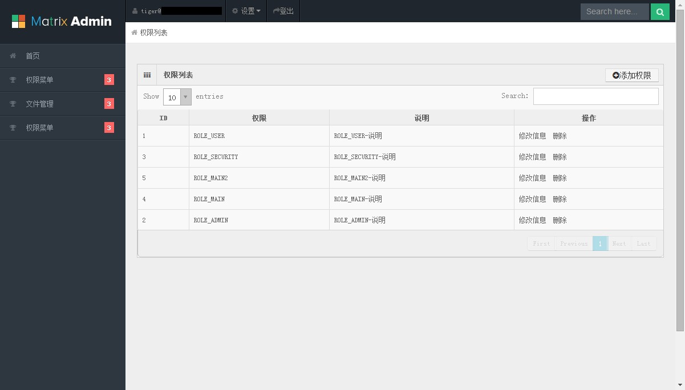
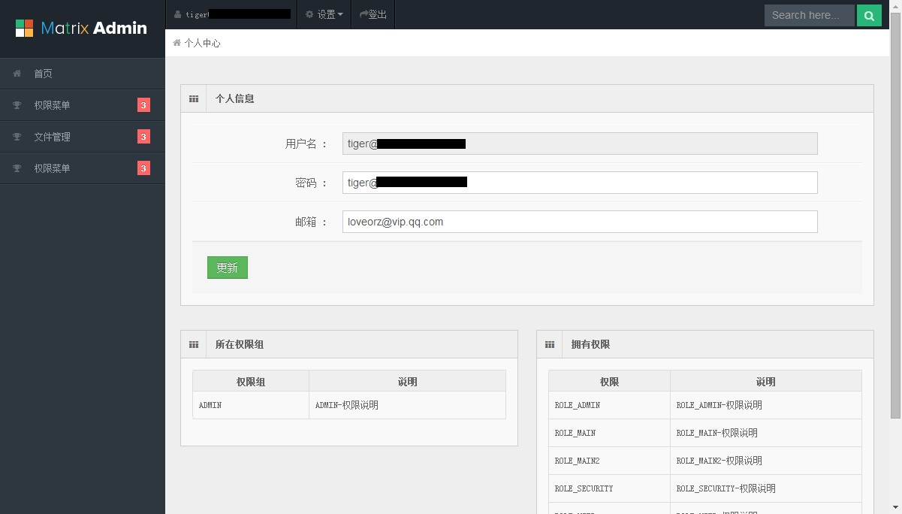

webapp
======

## 界面示例

##font-end
 
 * jQuery
 * bootstrap
 * matrix admin
 * jQuery UI
 * data-table
 * hight chart
 * UEditor
 * jQuery template
 * websocket
 * HTML5 Feature
 * responsible design

##views
 
 * JSP
 * JSP Customer Tag
 * SiteMesh
 * 内容协商视图

##controller
 
 * Spring MVC
 * REST Feature
 * Bean Validatoion
 * @GlobaleControllerDavice
 * MutiparteFile upload

##service
 
 * Transactional

##repository

 * Spring JDBC
 * Mybatis
 * Hibernate
 * Spring Data【MongoDB】

#domain
 
 * JPA
 * Hibernate Validator

##security
 
 * session管理
 * header管理
 * xss管理
 * csrf管理
 * 权限管理

##test

 * Spring mvc test feature
 * font-ent test
 * mockite
 * junit test
